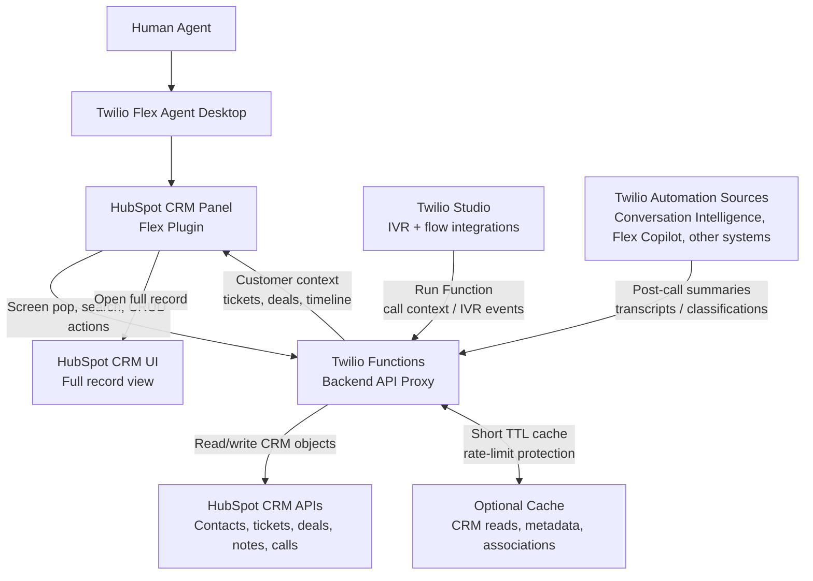

# Twilio Flex HubSpot CRM Blueprint

Reference implementation and architecture blueprint for integrating Twilio Flex with HubSpot CRM.

The project includes:

- A Twilio Flex plugin that renders HubSpot customer context inside the Flex agent desktop.
- A Twilio Functions backend that proxies HubSpot API access and keeps HubSpot credentials server-side.
- Example CRM workflows for contacts, tickets, notes, deals, activities, and post-call call logging.
- A reference architecture HTML page at `docs/flex-hubspot-reference-blueprint.html`.

## Why This Exists

HubSpot should not be treated as an iframeable CRM surface inside third-party applications. Modern CRM applications commonly restrict embedding for security, session, and clickjacking-protection reasons.

The integration pattern here is to build a programmable Flex CRM panel backed by HubSpot APIs:

- Flex gives agents a single pane of glass during calls.
- HubSpot remains the CRM source of truth.
- The backend controls credentials, caching, retries, and API limits.
- Agents can still open the full HubSpot record when needed.

## Repository Structure

```text
.
├── plugin-hubspot/      # Twilio Flex plugin, React/TypeScript
├── serverless/          # Twilio Functions backend for HubSpot API access
├── docs/                # Reference architecture docs and screenshots
└── README.md
```

## Features

- Screen pop by phone number for inbound and outbound calls
- Contact header with HubSpot deep link and Flex click-to-dial
- Details tab with contact fields and recent activity timeline
- Tickets tab with create, edit, priority, and status updates
- Notes tab with create and delete
- Deals tab with create, edit, pipeline stages, and won/lost actions
- Idle dashboard for searching contacts, tickets, and deals when no call is active
- Protected Studio function for automatically logging post-call summaries to HubSpot
- Backend-only HubSpot token handling

## Architecture



The Flex plugin calls the backend. The backend calls HubSpot APIs. Agents can still open the HubSpot CRM UI when they need the full record. HubSpot credentials never reach the browser.

## Prerequisites

- Node.js 18 or 20
- npm
- Twilio CLI
- Twilio CLI Flex plugin
- Twilio Flex project
- HubSpot account with a Private App token

Install the Twilio CLI Flex plugin if needed:

```bash
twilio plugins:install @twilio-labs/plugin-flex
```

Log in to Twilio:

```bash
twilio login
```

## HubSpot Private App Scopes

Create a HubSpot Private App and grant scopes for the objects you expose in Flex.

Minimum scopes used by this project:

- `crm.objects.contacts.read`
- `crm.objects.contacts.write`
- `crm.objects.companies.read`
- `crm.objects.deals.read`
- `crm.objects.deals.write`
- `tickets`
- Notes/calls scopes available for your HubSpot portal, typically under CRM objects or engagements

HubSpot scope names and availability can vary by portal and subscription. Verify the exact required scopes in your target HubSpot account before production.

## Backend Setup

```bash
cd serverless
cp .env.example .env
npm install
```

Edit `serverless/.env`:

```bash
HUBSPOT_API_KEY=your-hubspot-private-app-token
ACCOUNT_SID=ACxxxxxxxxxxxxxxxxxxxxxxxxxxxxxx
AUTH_TOKEN=your-twilio-auth-token
```

Deploy the functions:

```bash
npm run deploy -- --override-existing-project
```

Copy the deployed Functions domain, for example:

```text
https://your-functions-domain.twil.io
```

## Flex Plugin Setup

```bash
cd plugin-hubspot
cp .env.example .env
npm install
```

Edit `plugin-hubspot/.env`:

```bash
REACT_APP_FUNCTIONS_BASE_URL=https://your-functions-domain.twil.io
REACT_APP_HUBSPOT_PORTAL_ID=your-hubspot-portal-id
REACT_APP_HUBSPOT_REGION=eu1
```

Use `na1` for standard US HubSpot portals and `eu1` for EU portals.

## Local Development

Run the Flex plugin locally:

```bash
cd plugin-hubspot
twilio flex:plugins:start
```

Run Twilio Functions locally:

```bash
cd serverless
npm start
```

For local plugin development, `plugin-hubspot/public/appConfig.js` may be used as a runtime fallback. Production builds should use the `REACT_APP_*` values in `plugin-hubspot/.env`.

## Deploying The Flex Plugin

Build:

```bash
cd plugin-hubspot
twilio flex:plugins:build
```

Deploy:

```bash
twilio flex:plugins:deploy --changelog "HubSpot CRM integration"
```

Release the deployed version shown by the deploy output:

```bash
twilio flex:plugins:release \
  --plugin plugin-hubspot@0.0.1 \
  --name "HubSpot CRM Integration" \
  --description "HubSpot CRM panel for Twilio Flex"
```

## Studio Post-Call Logging

The backend includes a protected function:

```text
/log-call
```

Use a Twilio Studio **Run Function** widget, not a public HTTP request, to call this function.

Recommended parameters:

| Key | Value |
| --- | --- |
| `from` | `{{trigger.call.From}}` |
| `to` | `{{trigger.call.To}}` |
| `direction` | `{{trigger.call.Direction}}` |
| `conversationSummary` | `{{trigger.call.Param_conversationSummary}}` |
| `duration` | Call duration variable from your flow |
| `callSid` | `{{trigger.call.CallSid}}` |

The function picks the customer number based on call direction:

- Inbound: customer is `from`
- Outbound: customer is `to`

If no HubSpot contact matches the customer number, the function skips logging and does not create a new contact.

## Reference Blueprint

Open the reference architecture page:

```text
docs/flex-hubspot-reference-blueprint.html
```

It covers:

- Why the API-backed plugin pattern is preferable to iframe embedding
- Business benefits
- Agent screenshots
- Architecture
- Caching and API-limit strategy
- HubSpot partner/expert review points
- Production hardening checklist

## Publishing To GitHub

Recommended repository name:

```text
twilio-flex-hubspot-crm-blueprint
```

This name fits the repo because it contains both the working Flex/Functions implementation and the reference architecture material.

Suggested alternatives:

- `twilio-flex-hubspot-crm-panel`
- `flex-hubspot-screenpop`
- `twilio-hubspot-agent-workspace`

Before publishing, review `git status --short` and make sure only HubSpot integration files are staged.

## Production Considerations

- Add a server-side cache for phone-to-contact lookup, CRM metadata, tickets, deals, and activity lists.
- Use short TTLs for agent-facing customer data and longer TTLs for metadata such as owners, pipeline stages, and properties.
- Batch HubSpot API reads where possible.
- Retry rate-limited calls with exponential backoff and jitter.
- Make automation writes idempotent using Twilio Call SID or transcript SID.
- Vet the HubSpot object model, associations, pipeline stages, required fields, and scopes with a HubSpot expert before rollout.
- Consider OAuth instead of a shared private app token when you need per-agent attribution or multi-tenant distribution.

## License

MIT. See [LICENSE](LICENSE).
